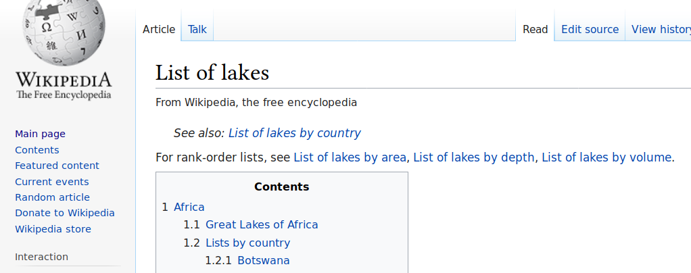
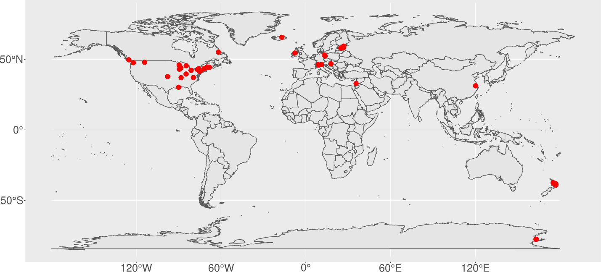

### Wikipedia is a primary source of lake information for many people

#### Lets look at information about a local lake [Elk Lake (British Columbia)](https://en.wikipedia.org/wiki/Elk_Lake_(British_Columbia)):

<table class="table" style="font-size: 16px; margin-left: auto; margin-right: auto;">
<tbody>
  <tr>
   <td style="text-align:left;font-weight: bold;border-right:1px solid;"> name </td>
   <td style="text-align:left;"> Elk and Beaver Lakes </td>
  </tr>
  <tr>
   <td style="text-align:left;font-weight: bold;border-right:1px solid;"> location </td>
   <td style="text-align:left;"> Saanich, British Columbia </td>
  </tr>
  <tr>
   <td style="text-align:left;font-weight: bold;border-right:1px solid;"> primary_inflows </td>
   <td style="text-align:left;"> O'Donnel Creek </td>
  </tr>
  <tr>
   <td style="text-align:left;font-weight: bold;border-right:1px solid;"> primary_outflows </td>
   <td style="text-align:left;"> Colquitz Creek </td>
  </tr>
  <tr>
   <td style="text-align:left;font-weight: bold;border-right:1px solid;"> catchment_area </td>
   <td style="text-align:left;"> 11.5 km^2 </td>
  </tr>
  <tr>
   <td style="text-align:left;font-weight: bold;border-right:1px solid;"> basin_countries </td>
   <td style="text-align:left;"> Canada </td>
  </tr>
  <tr>
   <td style="text-align:left;font-weight: bold;border-right:1px solid;"> surface_area </td>
   <td style="text-align:left;"> 2.46 km^2 </td>
  </tr>
  <tr>
   <td style="text-align:left;font-weight: bold;border-right:1px solid;"> max_depth </td>
   <td style="text-align:left;"> 17.9 m </td>
  </tr>
  <tr>
   <td style="text-align:left;font-weight: bold;border-right:1px solid;"> residence_time </td>
   <td style="text-align:left;"> 4.4 years </td>
  </tr>
  <tr>
   <td style="text-align:left;font-weight: bold;border-right:1px solid;"> lat </td>
   <td style="text-align:left;"> 48.52 </td>
  </tr>
  <tr>
   <td style="text-align:left;font-weight: bold;border-right:1px solid;"> lon </td>
   <td style="text-align:left;"> -123.39 </td>
  </tr>
</tbody>
</table>

## Explore some lake lists

## Explore some lake maps

### Let's look at a [map](https://gist.github.com/jsta/e486f337be6d5bcdb3aeb1335959de52) of well-studied lakes in Wikipedia

