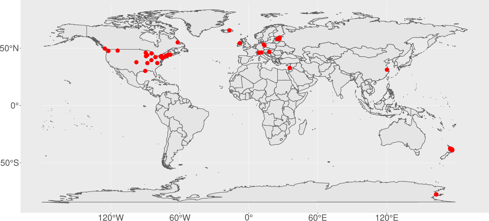

```{r chunk_options, echo=FALSE}
source("../bin/chunk-options.R")
```

### Wikipedia is a primary source of lake information for many people

#### Lets look at information about a local lake [Elk Lake (British Columbia)](https://en.wikipedia.org/wiki/Elk_Lake_(British_Columbia)):

```{r setup, eval=FALSE, echo=FALSE}
library(wikilake)
lake_wiki("Elk Lake (British Columbia)")
```

```{r elk_lake, message=FALSE, echo=FALSE, cache=TRUE, warning=FALSE}
library(wikilake)
library(dplyr)
library(tibble)
library(kableExtra)
library(knitr)
library(tidyr)
library(magrittr)

dt             <- lake_wiki("Elk Lake (British Columbia)")
original_names <- names(dt)
dt             <- janitor::clean_names(dt)

knitr::kable(tidyr::gather(dt), 
             format = "html", padding = -1L) %>%
  column_spec(1, bold = TRUE, border_right = TRUE) %>%
  kable_styling(font_size = 16)
```

## Explore some lake lists

```{r echo=FALSE}
knitr::include_graphics("../fig/wiki_lake_list.png")
```

## Explore some lake maps

### Let's look at a [map](https://gist.github.com/jsta/e486f337be6d5bcdb3aeb1335959de52) of well-studied lakes in Wikipedia

```{r map, echo=FALSE, message=FALSE, warning=FALSE, fig.width=20, fig.height=20}


```
